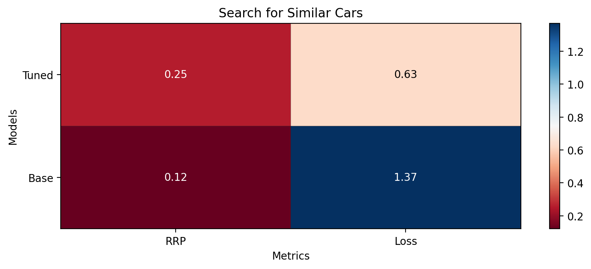

Similar cars search with similarity learning
++++++++++++++++++++++++++++++++++++++++++++++++++++


The focus of this tutorial is a step-by-step solution of a similarity learning problem with Quaterion.
Specifically, we will train a similarity model to search for similar cars.
This will also help us better understand how some of the essential building blocks in Quaterion fit together in a real project.
Let’s start walking through some of the important parts of the code.

If you are looking for the complete source code instead, you can find it under the
`examples <https://github.com/qdrant/quaterion/tree/master/examples/cars>`_
directory in the Quaterion repo.

Dataset
-------

In this tutorial, we will use the
`Stanford Cars <https://pytorch.org/vision/main/generated/torchvision.datasets.StanfordCars.html>`__
dataset. It has 16185 images of cars from 196 classes,
and it is split into training and testing subsets with almost a 50-50% split.
To make things even more interesting, however, we will first merge training and testing subsets,
then we will split it into two again in such a way that
the half of the 196 classes will be put into the training set
and the other half will be in the testing set.
This will let us test our model with samples from novel classes that it has never seen in the training phase,
which is what supervised classification cannot achieve but similarity learning can.

In the following code borrowed from `data.py <https://github.com/qdrant/quaterion/blob/master/examples/cars/data.py>`_: - ``get_datasets()``
function performs the splitting task described above. -
``get_dataloaders()`` function creates ``GroupSimilarityDataLoader``
instances from training and testing datasets. - Datasets are regular
PyTorch datasets that emit ``SimilarityGroupSample`` instances.

N.B.: Currently, Quaterion has two data types to represent samples in a
dataset. To learn more about ``SimilarityPairSample``, check out the
`NLP tutorial <https://quaterion.qdrant.tech/tutorials/nlp_tutorial.html>`_.

.. code:: python

   import numpy as np
   import os
   import tqdm
   from torch.utils.data import Dataset, Subset
   from torchvision import datasets, transforms
   from typing import Callable
   from pytorch_lightning import seed_everything

   from quaterion.dataset import (
       GroupSimilarityDataLoader,
       SimilarityGroupSample,
   )

   # set seed to deterministically sample train and test categories later on
   seed_everything(seed=42)

   # dataset will be downloaded to this directory under local directory
   dataset_path = os.path.join(".", "torchvision", "datasets")


   class CarsDataset(Dataset):
       def __init__(self, dataset: Dataset, transform: Callable):
           self._dataset = dataset
           self._transform = transform

       def __len__(self) -> int:
           return len(self._dataset)

       def __getitem__(self, index) -> SimilarityGroupSample:
           image, label = self._dataset[index]
           image = self._transform(image)

           return SimilarityGroupSample(obj=image, group=label)


   def get_datasets(input_size: int):
       # Use Mean and std values for the ImageNet dataset as the base model was pretrained on it.
       # taken from https://www.geeksforgeeks.org/how-to-normalize-images-in-pytorch/
       mean = [0.485, 0.456, 0.406]
       std = [0.229, 0.224, 0.225]

       # create train and test transforms
       transform = transforms.Compose(
           [
               transforms.Resize((input_size, input_size)),
               transforms.ToTensor(),
               transforms.Normalize(mean, std),
           ]
       )

       # we need to merge train and test splits into a full dataset first,
       # and then we will split it to two subsets again with each one composed of distinct labels.
       full_dataset = datasets.StanfordCars(
           root=dataset_path, split="train", download=True
       ) + datasets.StanfordCars(root=dataset_path, split="test", download=True)

       # full_dataset contains examples from 196 categories labeled with an integer from 0 to 195
       # randomly sample half of it to be used for training
       train_categories = np.random.choice(a=196, size=196 // 2, replace=False)

       # get a list of labels for all samples in the dataset
       labels_list = np.array([label for _, label in tqdm.tqdm(full_dataset)])

       # get a mask for indices where label is included in train_categories
       labels_mask = np.isin(labels_list, train_categories)

       # get a list of indices to be used as train samples
       train_indices = np.argwhere(labels_mask).squeeze()

       # others will be used as test samples
       test_indices = np.argwhere(np.logical_not(labels_mask)).squeeze()

       # now that we have distinct indices for train and test sets, we can use `Subset` to create new datasets
       # from `full_dataset`, which contain only the samples at given indices.
       # finally, we apply transformations created above.
       train_dataset = CarsDataset(
           Subset(full_dataset, train_indices), transform=transform
       )

       test_dataset = CarsDataset(
           Subset(full_dataset, test_indices), transform=transform
       )

       return train_dataset, test_dataset


   def get_dataloaders(
       batch_size: int,
       input_size: int,
       shuffle: bool = False,
   ):
       train_dataset, test_dataset = get_datasets(input_size)

       train_dataloader = GroupSimilarityDataLoader(
           train_dataset, batch_size=batch_size, shuffle=shuffle
       )

       test_dataloader = GroupSimilarityDataLoader(
           test_dataset, batch_size=batch_size, shuffle=False
       )

       return train_dataloader, test_dataloader


Trainable Model
---------------

Now it’s time to review `TrainableModel <https://quaterion.qdrant.tech/quaterion.train.trainable_model.html#module-quaterion.train.trainable_model>`_,
which is the base class for models you would like to configure for training.
It provides several hook methods starting with ``configure_`` to set up every aspect of the training phase just like
`pl.LightningModule <https://pytorch-lightning.readthedocs.io/en/stable/api/pytorch_lightning.core.LightningModule.html>`_,
its own base class. It is central to fine tuning with Quaterion, so we
will break down this essential code in ``models.py`` and review each
method separately. Let’s begin with the imports:

.. code:: python

   import torch
   import torchvision
   from quaterion_models.encoders import Encoder
   from quaterion_models.heads import EncoderHead, SkipConnectionHead
   from torch import nn
   from typing import Dict, Union, Optional, List

   from quaterion import TrainableModel
   from quaterion.eval.attached_metric import AttachedMetric
   from quaterion.eval.group import RetrievalRPrecision
   from quaterion.loss import SimilarityLoss, TripletLoss
   from quaterion.train.cache import CacheConfig, CacheType

   from .encoders import CarsEncoder

In the following code snippet, we subclass ``TrainableModel``. You may
use ``__init__()`` to store some attributes to be used in various
`configure_*` methods later on. The more interesting part is, however, in the
`configure_encoders() <https://quaterion.qdrant.tech/quaterion.train.trainable_model.html#quaterion.train.trainable_model.TrainableModel.configure_encoders>`_
method. We need to return an instance of
`Encoder <https://quaterion-models.qdrant.tech/quaterion_models.encoders.encoder.html#quaterion_models.encoders.encoder.Encoder>`_
(or a dictionary with ``Encoder`` instances as values) from this method.
In our case, it is an instance of ``CarsEncoders``, which we will review
soon. Notice now how it is created with a pretrained ResNet152 model
whose classification layer is replaced by an identity function.

.. code:: python

   class Model(TrainableModel):
       def __init__(self, lr: float, mining: str):
           self._lr = lr
           self._mining = mining
           super().__init__()

       def configure_encoders(self) -> Union[Encoder, Dict[str, Encoder]]:
           pre_trained_encoder = torchvision.models.resnet152(pretrained=True)
           pre_trained_encoder.fc = nn.Identity()
           return CarsEncoder(pre_trained_encoder)

In Quaterion, a
`SimilarityModel <https://quaterion-models.qdrant.tech/quaterion_models.model.html#quaterion_models.model.SimilarityModel>`_
is composed of one or more ``Encoder``\ s and an
`EncoderHead <https://quaterion-models.qdrant.tech/quaterion_models.heads.encoder_head.html#quaterion_models.heads.encoder_head.EncoderHead>`_.
``quaterion_models`` has
`several EncoderHead implementations <https://quaterion-models.qdrant.tech/quaterion_models.heads.html#module-quaterion_models.heads>`_
with a unified API such as a configurable dropout value. You may use one
of them or create your own subclass of ``EncoderHead``. In either case,
you need to return an instance of it from
`configure_head <https://quaterion.qdrant.tech/quaterion.train.trainable_model.html#quaterion.train.trainable_model.TrainableModel.configure_head>`_.
In this example, we will use a ``SkipConnectionHead``, which is
lightweight and more resistant to overfitting.

.. code:: python

       def configure_head(self, input_embedding_size) -> EncoderHead:
           return SkipConnectionHead(input_embedding_size, dropout=0.1)

Quaterion has implementations of
`some popular loss functions <https://quaterion.qdrant.tech/quaterion.loss.html>`_
for similarity learning, all of which subclass either
`GroupLoss <https://quaterion.qdrant.tech/quaterion.loss.group_loss.html#quaterion.loss.group_loss.GroupLoss>`_
or `PairwiseLoss <https://quaterion.qdrant.tech/quaterion.loss.pairwise_loss.html#quaterion.loss.pairwise_loss.PairwiseLoss>`_.
In this example, we will use
`TripletLoss <https://quaterion.qdrant.tech/quaterion.loss.triplet_loss.html#quaterion.loss.triplet_loss.TripletLoss>`_,
which is a subclass of ``GroupLoss``. In general, subclasses of
``GroupLoss`` are used with datasets in which samples are assigned with
some group (or label). In our example label is a make of the car. Those
datasets should emit ``SimilarityGroupSample``. Other alternatives are
implementations of ``PairwiseLoss``, which consume
``SimilarityPairSample`` - pair of objects for which similarity is
specified individually. To see an example of the latter, you may need to
check out the `NLP Tutorial <https://quaterion.qdrant.tech/tutorials/nlp_tutorial.html>`_.

.. code:: python

       def configure_loss(self) -> SimilarityLoss:
           return TripletLoss(mining=self._mining, margin=0.5)

``configure_optimizers()`` may be familiar to PyTorch Lightning users,
but there is a novel ``self.model`` used inside that method. It is an
instance of ``SimilarityModel`` and automatically created by Quaterion
from the return values of ``configure_encoders()`` and
``configure_head()``.

.. code:: python

       def configure_optimizers(self):
           optimizer = torch.optim.Adam(self.model.parameters(), self._lr)
           return optimizer

Caching in Quaterion is used for avoiding calculation of outputs of a
frozen pretrained ``Encoder`` in every epoch. When it is configured,
outputs will be computed once and cached in the preferred device for
direct usage later on. It provides both a considerable speedup and less
memory footprint. However, it is quite a bit versatile and has several
knobs to tune. To get the most out of its potential, it’s recommended
that you check out the
`cache tutorial <https://quaterion.qdrant.tech/tutorials/cache_tutorial.html>`_.
For the sake of making this article self-contained, you need to return a
`CacheConfig <https://quaterion.qdrant.tech/quaterion.train.cache.cache_config.html#quaterion.train.cache.cache_config.CacheConfig>`_
instance from
`configure_caches() <https://quaterion.qdrant.tech/quaterion.train.trainable_model.html#quaterion.train.trainable_model.TrainableModel.configure_caches>`_
to specify cache-related preferences such as:
- `CacheType <https://quaterion.qdrant.tech/quaterion.train.cache.cache_config.html#quaterion.train.cache.cache_config.CacheType>`_,
i.e., whether to store caches on CPU or GPU,
- ``save_dir``, i.e., where to persist caches for subsequent runs,
- ``batch_size``, i.e., batch size to be used only when creating caches - the batch size to be used
during the actual training might be different.

.. code:: python

       def configure_caches(self) -> Optional[CacheConfig]:
           return CacheConfig(
               cache_type=CacheType.AUTO, save_dir="./cache_dir", batch_size=32
           )

We have just configured training-related settings of a
``TrainableModel``. However, evaluation is an integral part of
experimentation in machine learning, and you may configure evaluation
metrics by returning one or more
`AttachedMetric <https://quaterion.qdrant.tech/quaterion.eval.attached_metric.html#quaterion.eval.attached_metric.AttachedMetric>`_
instances from ``configure_metrics()``. Quaterion has several built-in
`group <https://quaterion.qdrant.tech/quaterion.eval.group.html>`_
and `pairwise <https://quaterion.qdrant.tech/quaterion.eval.pair.html>`_
evaluation metrics.

.. code:: python

       def configure_metrics(self) -> Union[AttachedMetric, List[AttachedMetric]]:
           return AttachedMetric(
               "rrp",
               metric=RetrievalRPrecision(),
               prog_bar=True,
               on_epoch=True,
               on_step=False,
           )

Encoder
-------

As previously stated, a ``SimilarityModel`` is composed of one or more
``Encoder``\ s and an ``EncoderHead``. Even if we freeze pretrained
``Encoder`` instances, ``EncoderHead`` is still trainable and has enough
parameters to adapt to the new task at hand. It is recommended that you
set the ``trainable`` property to ``False`` whenever possible, as it
lets you benefit from the caching mechanism described above. Another
important property is ``embedding_size``, which will be passed to
``TrainableModel.configure_head()`` as ``input_embedding_size`` to let
you properly initialize the head layer. Let’s see how an ``Encoder`` is
implemented in the following code borrowed from `encoders.py <https://github.com/qdrant/quaterion/blob/master/examples/cars/encoders.py>`_:

.. code:: python

   import os

   import torch
   import torch.nn as nn
   from quaterion_models.encoders import Encoder


   class CarsEncoder(Encoder):
       def __init__(self, encoder_model: nn.Module):
           super().__init__()
           self._encoder = encoder_model
           self._embedding_size = 2048  # last dimension from the ResNet model

       @property
       def trainable(self) -> bool:
           return False

       @property
       def embedding_size(self) -> int:
           return self._embedding_size

An ``Encoder`` is a regular ``torch.nn.Module`` subclass, and we need to
implement the forward pass logic in the ``forward`` method. Depending on
how you create your submodules, this method may be more complex;
however, we simply pass the input through a pretrained ResNet152
backbone in this example:

.. code:: python

       def forward(self, images):
           embeddings = self._encoder.forward(images)
           return embeddings

An important step of machine learning development is proper saving and
loading of models. Quaterion lets you save your ``SimilarityModel`` with
```TrainableModel.save_servable()`` <https://quaterion.qdrant.tech/quaterion.train.trainable_model.html#quaterion.train.trainable_model.TrainableModel.save_servable>`_
and restore it with
```SimilarityModel.load()`` <https://quaterion-models.qdrant.tech/quaterion_models.model.html#quaterion_models.model.SimilarityModel.load>`_.
To be able to use these two methods, you need to implement ``save()``
and ``load()`` methods in your ``Encoder``. Additionally, it is also
important that you define your subclass of ``Encoder`` outside the
``__main__`` namespace, i.e., in a separate file from your main entry
point. It may not be restored properly otherwise.

.. code:: python

       def save(self, output_path: str):
           os.makedirs(output_path, exist_ok=True)
           torch.save(self._encoder, os.path.join(output_path, "encoder.pth"))

       @classmethod
       def load(cls, input_path):
           encoder_model = torch.load(os.path.join(input_path, "encoder.pth"))
           return CarsEncoder(encoder_model)

Training
--------

With all essential objects implemented, it is easy to bring them all
together and run a training loop with the
```Quaterion.fit()`` <https://quaterion.qdrant.tech/quaterion.main.html#quaterion.main.Quaterion.fit>`_
method. It expects: - A ``TrainableModel``, - A
```pl.Trainer`` <https://pytorch-lightning.readthedocs.io/en/stable/common/trainer.html>`_,
- A ```SimilarityDataLoader`` <https://quaterion.qdrant.tech/quaterion.dataset.similarity_data_loader.html#quaterion.dataset.similarity_data_loader.SimilarityDataLoader>`_
for training data,
- And optionally, another ``SimilarityDataLoader``
for evaluation data.

We need to import a few objects to prepare all of these:

.. code:: python

   import os
   import pytorch_lightning as pl
   import torch
   from pytorch_lightning.callbacks import EarlyStopping, ModelSummary

   from quaterion import Quaterion
   from .data import get_dataloaders
   from .models import Model

The ``train()`` function in the following code snippet expects several
hyperparameter values as arguments. They can be defined in a
``config.py`` or passed from the command line. However, that part of the
code is omitted for brevity. Instead let’s focus on how all the building
blocks are initialized and passed to ``Quaterion.fit()``, which is
responsible for running the whole loop. When the training loop is
complete, you can simply call ``TrainableModel.save_servable()`` to save
the current state of the ``SimilarityModel`` instance:

.. code:: python

   def train(
       lr: float,
       mining: str,
       batch_size: int,
       epochs: int,
       input_size: int,
       shuffle: bool,
       save_dir: str,
   ):

       model = Model(
           lr=lr,
           mining=mining,
       )
       
       
       train_dataloader, val_dataloader = get_dataloaders(
           batch_size=batch_size, input_size=input_size, shuffle=shuffle
       )

       early_stopping = EarlyStopping(
           monitor="validation_loss",
           patience=50,
       )

       trainer = pl.Trainer(
           gpus=1 if torch.cuda.is_available() else 0,
           max_epochs=epochs,
           callbacks=[early_stopping, ModelSummary(max_depth=3)],
           enable_checkpointing=False,
           log_every_n_steps=1,
       )

       Quaterion.fit(
           trainable_model=model,
           trainer=trainer,
           train_dataloader=train_dataloader,
           val_dataloader=val_dataloader,
       )

       model.save_servable(save_dir)

Evaluation
----------

Let’s see what we have achieved with these simple steps. `evaluate.py <https://github.com/qdrant/quaterion/blob/master/examples/cars/evaluate.py>`_
has two functions to evaluate both the baseline model and the tuned
similarity model. We will review only the latter for brevity. In
addition to the ease of restoring a ``SimilarityModel``, this code
snippet also shows how to use
```Evaluator`` <https://quaterion.qdrant.tech/quaterion.eval.evaluator.html#quaterion.eval.evaluator.Evaluator>`_
to evaluate the performance of a ``SimilarityModel`` on a given dataset
by given evaluation metrics. Full evaluation of a dataset usually grows
exponentially, and thus you may want to perform a partial evaluation on
a sampled subset. In this case, you may use
`samplers <https://quaterion.qdrant.tech/quaterion.eval.samplers.html>`_
to limit the evaluation. Similar to ``Quaterion.fit()`` used for training,
```Quaterion.evaluate()`` <https://quaterion.qdrant.tech/quaterion.main.html#quaterion.main.Quaterion.evaluate>`_
runs a complete evaluation loop. It takes the following as arguments: -
An ``Evaluator`` instance created with given evaluation metrics,and a ``Sampler``,
- The ``SimilarityModel`` to be evaluated,
- And the evaluation dataset.

.. code:: python

   def eval_tuned_encoder(dataset, device):
       print("Evaluating tuned encoder...")
       tuned_cars_model = SimilarityModel.load(
           os.path.join(os.path.dirname(__file__), "cars_encoders")
       ).to(device)
       tuned_cars_model.eval()

       result = Quaterion.evaluate(
           evaluator=Evaluator(
               metrics=RetrievalRPrecision(),
               sampler=GroupSampler(sample_size=1000, device=device, log_progress=True),
           ),
           model=tuned_cars_model,
           dataset=dataset,
       )

       print(result)

Conclusion
----------

In this tutorial, we trained a similarity model to search for similar
cars from novel categories unseen in the training phase. Then, we
evaluated it on a test dataset by the Retrieval R-Precision metric. The
base model scored 0.1207, and our tuned model hit 0.2540, a twice higher
score. These scored can be seen in the following figure:


