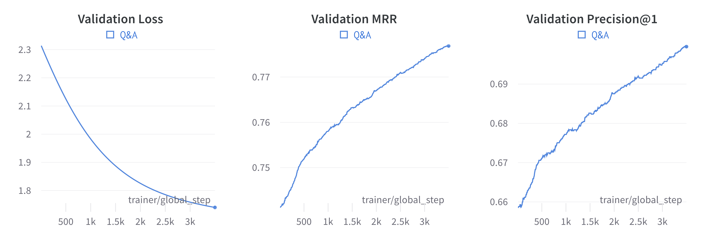

Question Answering with similarity learning
++++++++++++++++++++++++++++++++++++++++++++++++++++

Intro
===================
In this tutorial we will solve a Q&A problem to show how common NLP tasks can be tackled with
similarity learning and Quaterion.

We will use `cloud-faq-dataset <https://github.com/qdrant/dataset-cloud-platform-faq>`_.
This is a collection of almost 8.5k pairs of questions and answers from F.A.Q. pages of popular cloud providers.

.. figure:: https://storage.googleapis.com/quaterion/docs/faq-example.png
    :alt: Example of FAQ section

    Example of FAQ section

The usual pipeline in Quaterion includes the following steps:

1. Download and prepare a dataset
2. Create `Encoders <https://quaterion-models.qdrant.tech/quaterion_models.encoders.encoder.html#quaterion_models.encoders.encoder.Encoder>`_
3. Construct `TrainableModel </quaterion.train.trainable_model.html#quaterion.train.trainable_model.TrainableModel>`_
4. Train
5. Evaluate

Let's stick with it and implement step-by-step.

(For ones who are not interested in the text - here is a `repo <https://github.com/qdrant/demo-cloud-faq/tree/tutorial/faq>`_ with the whole tutorial code.)

Download & prepare dataset
==========================

Data can be downloaded via the following `bash` command:

.. code-block:: bash

    $ wget https://storage.googleapis.com/demo-cloud-faq/dataset/cloud_faq_dataset.jsonl -O cloud_faq_dataset.jsonl

Example of pairs presented in dataset:

        question: what is the pricing of aws lambda functions powered by aws graviton2 processors?

        answer: aws lambda functions powered by aws graviton2 processors are 20% cheaper compared to x86-based lambda functions

Data have to be represented as `SimilaritySample </quaterion.dataset.similarity_samples.html>`_ instances.
With questions and answers we can use `SimilarityPairSample </quaterion.dataset.similarity_samples.html#quaterion.dataset.similarity_samples.SimilarityPairSample>`_.

.. code-block:: python

    class SimilarityPairSample:
        obj_a: Any  # question
        obj_b: Any  # answer
        score: float = 1.0  # Measure of similarity. Usually converted to bool
        # Consider all examples outside this group as negative samples.
        # By default, all samples belong to group 0 - therefore other samples could not be used as negative examples.
        subgroup: int = 0

We will use `torch.utils.data.Dataset <https://pytorch.org/docs/stable/data.html>`_ to convert data and feed it to the model.

Code to split the data is omitted but can be found in the `repository <https://github.com/qdrant/demo-cloud-faq/blob/tutorial/faq/train_val_split.py>`_.

.. code-block:: python
    :caption: `dataset.py <https://github.com/qdrant/demo-cloud-faq/blob/tutorial/faq/dataset.py>`_

    import json
    from typing import List, Dict
    from torch.utils.data import Dataset
    from quaterion.dataset.similarity_samples import SimilarityPairSample

    class FAQDataset(Dataset):

        def __init__(self, dataset_path):
            self.dataset: List[Dict[str, str]] = self.read_dataset(dataset_path)

        def __getitem__(self, index) -> SimilarityPairSample:
            line = self.dataset[index]
            question = line["question"]
            # All questions have a unique subgroup
            # Meaning that all other answers are considered negative pairs
            subgroup = hash(question)
            score = 1
            return SimilarityPairSample(
                obj_a=question, obj_b=line["answer"], score=score, subgroup=subgroup
            )

        def __len__(self):
            return len(self.dataset)

        @staticmethod
        def read_dataset(dataset_path) -> List[Dict[str, str]]:
            """Read jsonl-file into a memory."""
            with open(dataset_path, "r") as fd:
                return [json.loads(json_line) for json_line in fd]

Encoder definition
====================

We are going to use pretrained ``all-MiniLM-L6-v2`` from `sentence-transformers <https://www.sbert.net/>`_ library as our text encoder.

.. code-block:: python
    :caption: `encoder.py <https://github.com/qdrant/demo-cloud-faq/blob/tutorial/faq/encoder.py>`_

    import os
    from torch import Tensor, nn
    from sentence_transformers.models import Transformer, Pooling
    from quaterion_models.types import TensorInterchange, CollateFnType
    from quaterion_models.encoders import Encoder

    class FAQEncoder(Encoder):
        def __init__(self, transformer, pooling):
            super().__init__()
            self.transformer = transformer
            self.pooling = pooling
            self.encoder = nn.Sequential(self.transformer, self.pooling)

        @property
        def trainable(self) -> bool:
            # Defines if we want to train encoder itself, or head layer only
            return False

        @property
        def embedding_size(self) -> int:
            return self.transformer.get_word_embedding_dimension()

        def forward(self, batch: TensorInterchange) -> Tensor:
            return self.encoder(batch)["sentence_embedding"]

        def get_collate_fn(self) -> CollateFnType:
            # `collate_fn` is a function that converts input samples into Tensor(s) for use as encoder input.
            return self.transformer.tokenize

        @staticmethod
        def _transformer_path(path: str) -> str:
            # just an additional method to reduce amount of repeated code
            return os.path.join(path, "transformer")

        @staticmethod
        def _pooling_path(path: str) -> str:
            return os.path.join(path, "pooling")

        def save(self, output_path: str):
            # to provide correct saving of encoder layers we need to implement it manually
            transformer_path = self._transformer_path(output_path)
            os.makedirs(transformer_path, exist_ok=True)

            pooling_path = self._pooling_path(output_path)
            os.makedirs(pooling_path, exist_ok=True)

            self.transformer.save(transformer_path)
            self.pooling.save(pooling_path)

        @classmethod
        def load(cls, input_path: str) -> Encoder:
            transformer = Transformer.load(cls._transformer_path(input_path))
            pooling = Pooling.load(cls._pooling_path(input_path))
            return cls(transformer=transformer, pooling=pooling)

We return ``False`` in ``trainable`` - it means that our encoder is frozen and the encoder's weights won't change during training.

Trainable model constructing
============================
One of the main entities in Quaterion is ``TrainableModel``.
It handles the majority of the training routine and constructs the final model from blocks.
Here we need to configure encoders, heads, loss, optimizer, metrics, cache, etc.
``TrainableModel`` is actually `pytorch_lightning.LightningModule <https://pytorch-lightning.readthedocs.io/en/latest/common/lightning_module.html>`_, hence obtains all ``LightningModule`` features.

.. code-block:: python
    :caption: `model.py <https://github.com/qdrant/demo-cloud-faq/blob/tutorial/faq/model.py>`_

    from quaterion.eval.attached_metric import AttachedMetric
    from torch.optim import Adam
    from quaterion import TrainableModel
    from quaterion.train.cache import CacheConfig, CacheType
    from quaterion.loss import MultipleNegativesRankingLoss
    from sentence_transformers import SentenceTransformer
    from quaterion.eval.pair import RetrievalPrecision, RetrievalReciprocalRank
    from sentence_transformers.models import Transformer, Pooling
    from quaterion_models.heads.skip_connection_head import SkipConnectionHead

    class FAQModel(TrainableModel):
        def __init__(self, lr=10e-5, *args, **kwargs):
            self.lr = lr
            super().__init__(*args, **kwargs)

        def configure_metrics(self):
            # attach batch-wise metrics which will be automatically computed and logged during training
            return [
                AttachedMetric(
                    "RetrievalPrecision",
                    RetrievalPrecision(k=1),
                    prog_bar=True,
                    on_epoch=True,
                ),
                AttachedMetric(
                    "RetrievalReciprocalRank",
                    RetrievalReciprocalRank(),
                    prog_bar=True,
                    on_epoch=True
                ),
            ]

        def configure_optimizers(self):
            return Adam(self.model.parameters(), lr=self.lr)

        def configure_loss(self):
            # `symmetric` means that we take into account correctness of both the closest answer to a question and the closest question to an answer
            return MultipleNegativesRankingLoss(symmetric=True)

        def configure_encoders(self):
            pre_trained_model = SentenceTransformer("all-MiniLM-L6-v2")
            transformer: Transformer = pre_trained_model[0]
            pooling: Pooling = pre_trained_model[1]
            encoder = FAQEncoder(transformer, pooling)
            return encoder

        def configure_head(self, input_embedding_size: int):
            return SkipConnectionHead(input_embedding_size)

        def configure_caches(self):
            # Cache stores frozen encoder embeddings to prevent repeated calculations and increase training speed.
            # AUTO preserves the current encoder's device as storage, batch size does not affect training and is used only to fill the cache before training.
            return CacheConfig(CacheType.AUTO, batch_size=256)

Train & Evaluate
============================
We will merge the last 2 steps and perform training and evaluation in one function.
For the training process we need to create `pytorch_lightning.Trainer <https://pytorch-lightning.readthedocs.io/en/latest/common/trainer.html>`_ instance to handle training routine,
also datasets and data loaders instances to prepare our data and feed it to the model.
Finally, to launch the training process all of these should be passed to `Quaterion.fit </quaterion.main.html#quaterion.main.Quaterion.fit>`_.
Batch-wise evaluation will be performed during training, but it can fluctuate a lot depending on a batch size.
More representative results from larger part of the data can be obtained via `Evaluator </quaterion.eval.evaluator.html#quaterion.eval.evaluator.Evaluator>`_ and `Quaterion.evaluate </quaterion.main.html#quaterion.main.Quaterion.evaluate>`_.

At the end trained model is saved under `servable` dir.

.. code-block:: python
    :caption: `train.py <https://github.com/qdrant/demo-cloud-faq/blob/tutorial/faq/train.py>`_

    import os

    import torch
    import pytorch_lightning as pl

    from quaterion import Quaterion
    from quaterion.dataset import PairsSimilarityDataLoader
    from quaterion.eval.evaluator import Evaluator
    from quaterion.eval.pair import RetrievalReciprocalRank, RetrievalPrecision
    from quaterion.eval.samplers.pair_sampler import PairSampler

    DATA_DIR = 'data'

    def run(model, train_dataset_path, val_dataset_path, params):
        use_gpu = params.get("cuda", torch.cuda.is_available())

        trainer = pl.Trainer(
            min_epochs=params.get("min_epochs", 1),
            max_epochs=params.get("max_epochs", 300),  # cache makes it possible to use a huge amount of epochs
            auto_select_gpus=use_gpu,
            log_every_n_steps=params.get("log_every_n_steps", 10),  # increase to speed up training
            gpus=int(use_gpu),
            num_sanity_val_steps=2,
        )
        train_dataset = FAQDataset(train_dataset_path)
        val_dataset = FAQDataset(val_dataset_path)
        train_dataloader = PairsSimilarityDataLoader(train_dataset, batch_size=1024)
        val_dataloader = PairsSimilarityDataLoader(val_dataset, batch_size=1024)
        Quaterion.fit(model, trainer, train_dataloader, val_dataloader)

        metrics = {
            "rrk": RetrievalReciprocalRank(),
            "rp@1": RetrievalPrecision(k=1)
        }
        sampler = PairSampler()
        evaluator = Evaluator(metrics, sampler)
        results = Quaterion.evaluate(evaluator, val_dataset, model.model)  # calculate metrics on the whole dataset to obtain more representative metrics values
        print(f"results: {results}")

    # launch training
    pl.seed_everything(42, workers=True)
    faq_model = FAQModel()
    train_path = os.path.join(DATA_DIR, "train_cloud_faq_dataset.jsonl")
    val_path = os.path.join(DATA_DIR, "val_cloud_faq_dataset.jsonl")
    run(faq_model, train_path, val_path, {})
    faq_model.save_servable("servable")

Here are some of the plots observed during training. As you can see, the loss decreased, while the metrics grew steadily.

    Learning curves

Additionally, let's take a look at our model's performance:

.. code-block::
  :caption: Output of `serve.py <https://github.com/qdrant/demo-cloud-faq/blob/tutorial/faq/serve.py>`_

    Q: what is the pricing of aws lambda functions powered by aws graviton2 processors?
    A: aws lambda functions powered by aws graviton2 processors are 20% cheaper compared to x86-based lambda functions

    Q: can i run a cluster or job for a long time?
    A: yes, you can run a cluster for as long as is required

    Q: what is the dell open manage system administrator suite (omsa)?
    A: omsa enables you to perform certain hardware configuration tasks and to monitor the hardware directly via the operating system

    Q: what are the differences between the event streams standard and event streams enterprise plans?
    A: to find out more information about the different event streams plans, see choosing your plan

That's it! We've just trained similarity learning model to solve Question Answering problem!

Further learning
=================
In the case you followed the tutorial step-by-step you might be surprised by the speed of the training
process with Quaterion.
This is mainly the merit of the cache and frozen encoder.
Check out our `cache tutorial </tutorials/cache_tutorial.html>`_.